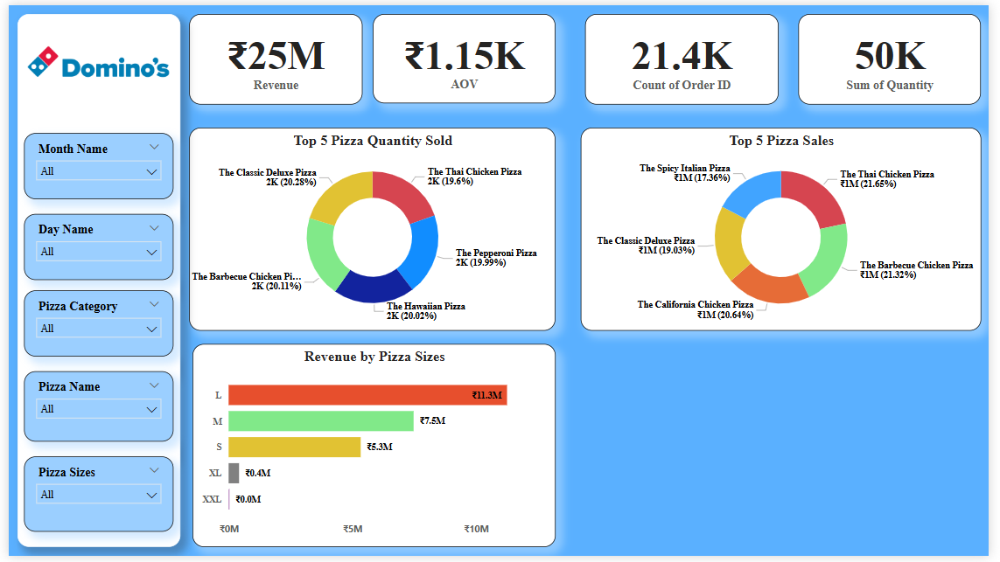

# 🍕 Domino’s Sales Dashboard

## 📌 Project Overview  
This **Domino’s Sales Dashboard** provides a **comprehensive analysis** of pizza sales, revenue trends, and customer preferences. The goal is to gain **data-driven insights** to help **optimize sales strategies and maximize revenue**.

The analysis involves:  
✔ Extracting and cleaning sales data  
✔ Transforming data for accurate reporting  
✔ Visualizing key metrics using Power BI  

---

## 📊 Key Metrics & Insights  

### 🔥 1. Sales Performance Overview  
- **Total Revenue:** ₹25M  
- **Average Order Value (AOV):** ₹1.15K  
- **Total Quantity Sold:** 50K  
- **Total Orders:** 24K  
- **Average Orders per Customer:** 235  

💡 **Insight:** These metrics provide a **high-level business performance view**, showing revenue generation and order volume.  

---

### 📅 2. Sales Trends Analysis  
- **📈 Sales by Month:**  
  - Revenue **peaks in April, July, and December**.  
  - Lowest sales are recorded in **September and October**.  

- **📅 Sales by Day:**  
  - **Wednesdays generate the highest sales (~₹4.02M).**  
  - **Fridays see the lowest sales (~₹3M).**  

- **⏰ Sales by Hour:**  
  - **Peak hours: 12 PM (lunch) & 6 PM (dinner).**  
  - **Lowest orders:** Early mornings and late nights.  

🔹 **Business Strategy:**  
✔ Offer **discounts & promotions** during low-performing months (Sept & Oct).  
✔ **Boost sales on Fridays** with targeted deals.  
✔ **Introduce special meal combos** during peak hours (12 PM & 6 PM).  

---

### 🍕 3. Revenue Distribution  

#### **📏 Revenue by Pizza Size:**  
- **Large (L) pizzas generate the highest revenue (~₹11.3M).**  
- **Medium (M) pizzas contribute ₹7.5M**, followed by **Small (S) at ₹5.3M**.  
- **XL and XXL pizzas underperform (~₹0.4M and ₹0M, respectively).**  

🔹 **Actionable Insights:**  
✔ **Focus marketing efforts** on Large and Medium pizzas.  
✔ Introduce **combo deals & discounts** for XL and XXL pizzas to increase sales.  

#### **🍽️ Revenue by Pizza Category:**  
- **Classic Pizzas** lead sales (~₹6.6M).  
- **Supreme Pizzas** (~₹6.2M) and **Chicken Pizzas** (~₹5.9M) follow closely.  
- **Veggie Pizzas (~₹5.8M) also perform well.**  

🔹 **Business Strategy:**  
✔ Expand **Classic & Supreme pizza varieties**.  
✔ Introduce **seasonal flavors** or **limited-edition toppings**.  

---

### ⭐ 4. Top-Selling Pizzas & Customer Preferences  
- **The Thai Chicken Pizza** (35.62%) is the top seller.  
- **Other best-selling pizzas:**  
  - The Spinach Supreme Pizza (12.53%)  
  - The Vegetables + Vegetables Pizza (19.99%)  
  - The Classic Deluxe Pizza (20.28%)  

🔹 **Business Strategy:**  
✔ **Promote top pizzas** with special offers.  
✔ **Launch new variants** based on best-selling flavors.  

---

## 🎯 Key Recommendations  
✔ **Increase Sales in Low-Performing Periods:**  
  - Implement **discounts & marketing campaigns** in Sept, Oct, and on Fridays.  

✔ **Boost XL & XXL Pizza Sales:**  
  - Introduce **combo deals & bundle offers** to drive demand.  

✔ **Leverage Peak Hours (12 PM & 6 PM):**  
  - Offer **meal combos & exclusive deals** during lunch and dinner.  

✔ **Capitalize on Best-Selling Pizzas:**  
  - **Highlight top pizzas** in ads and introduce **seasonal specials**.  

---

## 🖼 Power BI Dashboard Preview  

## 🖼 Power BI Dashboard Preview  

## 🏅 Connect with Me
If you liked this project or have any suggestions, feel free to connect!  
📧 Email: tyagivishal8583@gmail.com  
🔗 LinkedIn: [Vishal Tyagi](https://www.linkedin.com/in/vishal-tyagi00/)  

